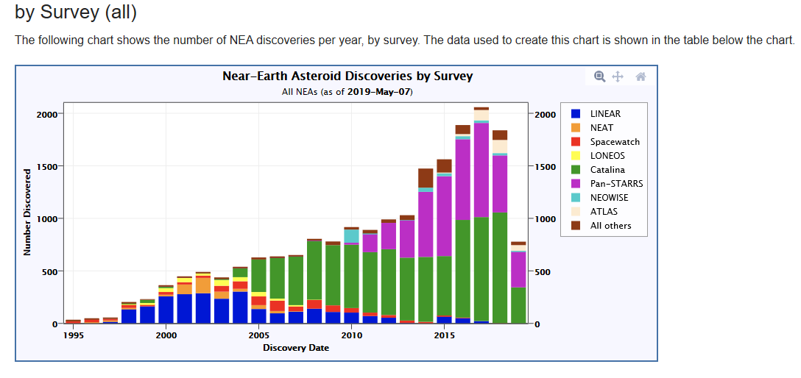

```{r  message=FALSE, echo=FALSE}
library(dplyr)
library(tidyr)
library(ggplot2)
library(ggthemes)
asteroids_clean <- read.csv("asteroids_clean.csv")
#head(asteroids_clean)
#transform Date to as.Date
#select_data<-select(asteroids_clean, Date)
#select_data<-data.frame(lapply(select_data,as.Date))#Not working!!!
#delet old column
#asteroids_clean<-asteroids_clean[,-3]
# bind new column back with numeric values
#asteroids_clean<-bind_cols(asteroids_clean, select_data)

#head(asteroids_clean)
```

# NEO Earth Close Approaches 

As they orbit the Sun, Near-Earth Objects occasionally approach close to Earth. CNEOS calculates the motion of all NEOs forwards to 2200 A.D. and backwards to 1900 A.D., and determines the times and distances of the Earth close approaches. The results are tabulated [here](https://cneos.jpl.nasa.gov/ca/). You can customize the contents and organization of the table via the Table Settings pulldown lists.

## Including Plots

```{r message=FALSE, echo=FALSE}
#asteroids_clean from 1-20000 rows
library(ggthemes)
ggplot(asteroids_clean, aes(x = X, y = Diam_min)) + geom_point(aes(col = Speed_kms),  size=1.5, alpha=0.5)+labs(title = "Asteroids aproaches")+scale_x_continuous(name="Asteroids aproaches in time")+geom_smooth(method="loess", se=F)
db<-asteroids_clean%>%filter(Diam_min < 100)
ggplot(db, aes(x = X, y = Diam_min)) + geom_point(aes(col = Speed_kms), size=1.5,alpha=0.5)+theme(axis.text.x = element_text(color = "blue",size=8, angle = 45))+labs(title = "Zoom less than 100m Asteroids aproaches")+scale_x_continuous(name="Asteroids aproaches in time")+geom_smooth(method="loess", se=F)  


```

## Zoom in the middle.

```{r message=FALSE, echo=FALSE}
asteroids_clean1<-asteroids_clean[5000:13000,]
#library(ggthemes)
library(ggthemes)

ggplot(asteroids_clean1, aes(x = X, y = Diam_min)) + geom_point(size=1.5,alpha=0.05)+theme(axis.text.x = element_text(color = "blue",size=8, angle = 45))+labs(title = "Asteroids aproaches")+scale_x_continuous(name="Asteroids aproachesin time")

```

## Result shows clear in the middle one kind of anomaly.

In this plot we can see missing appoaches in the middle. What this mean less activity or missing data. We know from 2005 we started to search more intense for asteroids. If this anomaly is real we live now in the middle of relative quite time which ends around 2050. Or Data looks like it dropped down some how?


# Most closest aproaches to the Eearth.

```{r message=FALSE, echo=FALSE}

#ggplot(asteroids_clean, aes(Object, fill=Speed_kms))+geom_bar()
#ggplot(asteroids_clean, aes(Object, fill=Moondist_LD_nom))+geom_bar()
#db<-asteroids_clean%>%filter(Speed_kms < 10)
#ggplot(db, aes(Object, fill=Speed_kms))+geom_bar()
db<-asteroids_clean%>%filter(Moondist_LD_nom < 0.12)
#View(db)
ggplot(db, aes(x=Object, y=Moondist_LD_nom))+geom_point(aes(size=Diam_min, color=Speed_kms))+theme(axis.text.x = element_text(color = "blue",size=8, angle = 45, hjust=1))
```


# Discovery Statistics

### "NEC" are Near-Earth comets. "PHA-km" and "NEA-km" are PHAs and NEAs with diameters roughly one kilometer and larger. "NEA-140m" are NEAs with diameters roughly 140 meters and larger. Other definitions, such as Apollo, are on the NEO groups page. This jump in descoveries from new satelite 

```{r message=FALSE, echo=FALSE}
Desc_asteroids <- read.csv("Discovery StatisticsPrintDownloadMay052019.csv")
#head(Desc_asteroids)
#View(Obser_asteroids)
#transform Date to as.Date
select_data<-select(Desc_asteroids, Date)
select_data<-data.frame(lapply(select_data,as.Date))
#delet old column
Desc_asteroids1<-Desc_asteroids[,-1]
# bind new column back with numeric values
Desc_asteroids<-bind_cols(Desc_asteroids1, select_data)
ggplot(Desc_asteroids, aes(x = Date, y = NEA)) + geom_point(color= "red")
ggplot(Desc_asteroids, aes(x = Date, y = NEA.140m)) + geom_point(color= "blue")
ggplot(Desc_asteroids, aes(x = Date, y = NEA.km)) + geom_point(color= "green")
ggplot(Desc_asteroids, aes(x = Date, y = PHA.km)) + geom_point(color= "yellow")
```

#### If we take the last 100 observations(around last 8 years of observations) from all asteroids table. What we can see?

```{r message=FALSE, echo=FALSE}
Obser_asteroids<- Desc_asteroids[1:100,]
#View(Obser_asteroids)
#transform Date to as.Date
select_data<-select(Obser_asteroids, Date)
select_data<-data.frame(lapply(select_data,as.Date))
#delet old column
Obser_asteroids1<-Obser_asteroids[,-1]
# bind new column back with numeric values
Obser_asteroids2<-bind_cols(Obser_asteroids1, select_data)

ggplot(Obser_asteroids2, aes(Date, NEA)) + geom_point(color= "red")+ scale_x_date(date_labels = "%Y-%b")+xlab("") 
ggplot(Obser_asteroids2, aes(Date, NEA.140m)) + geom_point(color= "blue")
ggplot(Obser_asteroids2, aes(x = Date, y = NEA.km)) + geom_point(color= "green")
ggplot(Obser_asteroids2, aes(x = Date, y = PHA.km)) + geom_point(color= "yellow")

```

#### We discovered in 8 years NEA(140m<10m)~3700, NEA(140m+)~1200, NEA.km(1km+)~75, Comets(PHA)~10. If we assume it is nomal distribution we descovered only 10 or 30 % of all asteroids and maybe 50% for NEA(1km+). Ground-based telescopes alone have limitations - for instance, they can only survey the skies at night and in clear skies. Based on statistical population estimates, about two thirds of NEOs larger than 460 feet still remain to be discovered.



#### This plot shows when we use new tool for descovery asteroids number of descoveries going up.


# Fireball and Bolide Data

#### The following chart shows reported fireball events for which geographic location data are provided in the period of 31 years. Each events calculated total impact energy is indicated by its relative size and by a color. Hover over an event to see its details.


#Summary.

#### Fireballs show relative low energy burst with only 2 red big circles (diamiter around 15m unkown asteroids hit without warrning) which can do some damage to our infrastructure. The Probability is One in 15 years. 
####In 1908 Tungustka  meteorit 60-190m size  flattened 2,000 square kilometres (770 square miles) of forest which is Thailand size of country or 60 mln people and GDP US$500 billion per year. Other biblical references to Sodom and Gomorrah presumably were devastated about 1900 BC by earthquake or asteroid most likely. The Probability is one in 2000 years. 
####And the Bigest one mass extictions 65 million years ago wiped out the dinozaurs.

#Future

#### 1. We can see most likely asteriods will do some damage in near future, because of increase in population ( 9 billion by 2050) and urbanizations.
#### 2. How much money should we invest in study develop some kind of protection? The Near-Earth Object Observations Program provides $4.5 million a year( this is a drop should be a billion at least) in funding to the Arecibo Observatory in Puerto Rico - about one third of the observatory's yearly budget - to fund its planetary radar capability.
#### 3. What the benifit should be from protecting, exploring and extracting minerals from asteroids and maybe traveling on them some times? This is kind of war which will push our civilization to the next level beyond the horizont or will be final exam.It seems likely that in the next century when we begin to colonize the inner solar system, the metals and minerals found on asteroids will provide the raw materials for space structures and comets will become the watering holes and gas stations for interplanetary spacecraft.
#### 4.No one should be overly concerned about an Earth impact of an asteroid or comet. The threat till now to any one person from auto accidents, disease, other natural disasters and a variety of other problems is much higher than the threat from NEOs. Over long periods of time, however, the chances of the Earth being impacted are not negligible so that some form of NEO insurance is warranted. At the moment, our best insurance rests with the NEO scientists and their efforts to first find these objects and then track their motions into the future. We need to first find them, then keep an eye on them.
